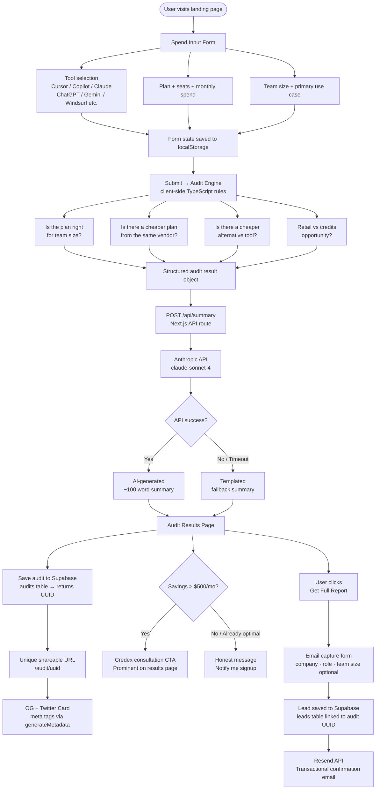

# ARCHITECTURE

## What this app does (in one line)
A free AI spend audit tool that takes a startup's current AI tool subscriptions, analyses whether they are overspending, and surfaces cheaper alternatives — with a lead capture for Credex consultations.

---

## System Diagram

---

## Data Flow — Step by Step

### Step 1 — Input
The user fills the spend form. Every change is written to `localStorage` so a page reload does not lose their data. No server call happens at this step.

### Step 2 — Audit engine (client-side)
On form submit, the audit engine runs entirely in the browser — no API call, no latency. It is a set of deterministic TypeScript rules:
- **Plan fit check** — e.g. Claude Team plan for 2 users costs $60/mo; Claude Pro × 2 = $40/mo and covers the same use case
- **Same-vendor downgrade** — is there a lower plan from the same vendor that fits their usage?
- **Cross-vendor alternative** — for their use case (coding / writing / data / research), is there a meaningfully cheaper tool?
- **Credits opportunity** — flags high retail spenders as Credex leads

Output: a typed array of `AuditRecommendation` objects with `tool`, `currentSpend`, `recommendedAction`, `projectedSpend`, `monthlySaving`, and `reason`.

### Step 3 — AI summary
The audit result object is sent to `/api/summary` (a Next.js API route). This calls the Anthropic API with a prompt that includes the user's use case, team size, and top 3 recommendations. The route has a 5-second timeout — if Anthropic is slow or unavailable, it returns a pre-written templated summary instead. The UI never shows a blank or broken state.

### Step 4 — Shareable URL
The full audit (inputs + recommendations + summary) is written to Supabase (`audits` table). The returned UUID becomes the public URL: `/audit/[uuid]`. This page is server-rendered so Open Graph and Twitter Card meta tags are set correctly for link previews. Email and company name are stripped from the public version.

### Step 5 — Lead capture
After seeing results, the user can optionally enter their email to receive the full report. This creates a record in the `leads` table (linked to the audit UUID) and triggers a Resend transactional email. For audits showing >$500/mo savings, the email mentions Credex and the results page shows a consultation booking CTA.

---

## Stack

| Layer | Choice | Why |
|---|---|---|
| Framework | Next.js 14 (App Router) | Server-side rendering needed for OG tags on shareable URLs. API routes handle Anthropic + Resend calls securely (no API keys exposed to browser). Vercel deploy is one command. |
| Language | TypeScript | The audit engine has ~20 typed rule objects. TypeScript catches shape mismatches at compile time — a plan name typo silently returns `undefined` in plain JS. |
| Styling | Tailwind CSS | Utility-first, fast to build polished UI without a separate CSS file per component. |
| Database | Supabase (Postgres) | Free tier covers this use case. Real Postgres so the schema is portable. Row-level security keeps leads private. |
| Email | Resend | 3,000 emails/month free. Clean API. Works with React Email for templated emails. |
| Deployment | Vercel | Zero-config Next.js deploy. Preview URL on every PR so the deployed link always works. |
| Testing | Vitest | Faster than Jest for this setup. Same API. Works with TypeScript out of the box. |
| CI | GitHub Actions | Native to GitHub, free for public repos, runs lint + test on every push to main. |

---

## Why Next.js over other options

**Why not plain React (Vite/CRA)?**
The shareable audit URL (`/audit/[uuid]`) needs server-side Open Graph meta tags so the link preview shows the savings number when shared on Twitter or Slack. Plain React is client-side only — OG tags set via JavaScript are not picked up by social media crawlers. Next.js `generateMetadata` solves this with zero extra infrastructure.

**Why not Vue or Svelte?**
Same reason — SSR for OG tags. Both Vue (Nuxt) and Svelte (SvelteKit) could technically do this, but Next.js + Vercel is the most battle-tested combination for this pattern. Faster to ship correctly.

**Why not plain JavaScript?**
The audit engine maps tool + plan + team size combinations to recommendations. With TypeScript, if `plan` is typed as `'Pro' | 'Team' | 'Enterprise'`, a typo like `'pro'` is a compile error. Without types, it is a silent bug that only shows up when a user gets a wrong recommendation.

---

## What would change at 10,000 audits/day

1. **Anthropic API rate limits** — queue summary generation with BullMQ on Upstash Redis. The UI polls for the result instead of waiting synchronously. The 5-second timeout fallback already handles the user-facing side.

2. **Supabase connection limits** — the free tier allows 60 connections. At 10k/day with burst traffic, enable PgBouncer (built into Supabase) or switch to the Supabase serverless driver (`@supabase/supabase-js` with `fetch` transport).

3. **Shareable URL read performance** — audits are immutable after creation. Add a Redis cache (Upstash) on the `/audit/[uuid]` route with a 1-hour TTL. Near-zero database load for popular shared links.

4. **Email volume** — Resend free tier caps at 3,000/month. At 10% email capture on 10k audits that is 1,000 emails/day → 30,000/month. Upgrade to Resend paid ($20/mo for 50k) or move to AWS SES ($0.10 per 1,000).

5. **Abuse protection** — move from in-memory rate limiting to a Redis-backed sliding window via Upstash Ratelimit, applied at the edge in Next.js middleware before requests hit the API routes.